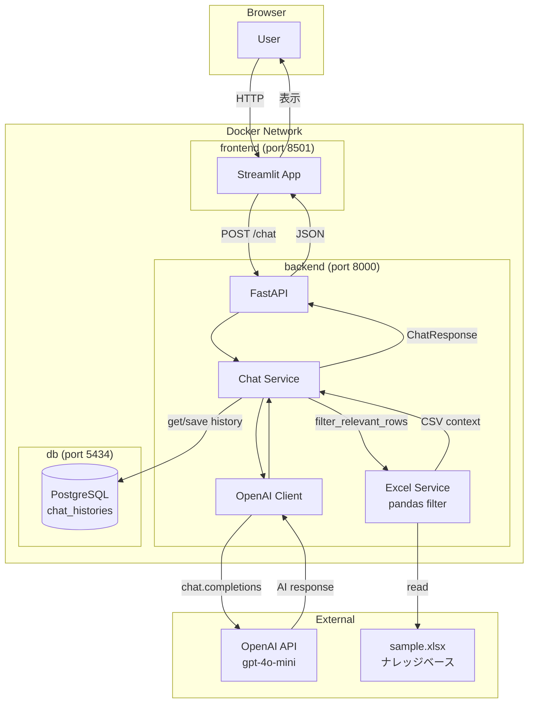

# InternalAI-InquirySystem

社内ナレッジベース（Excel）に基づいて質問に回答する、AI搭載の社内問い合わせシステムです。

---

## 特徴

- **ベクトルDB不要のRAG構成** — Pandasのキーワードフィルタリングだけでコンテキストを抽出し、OpenAI APIへ渡します。PineconeやChromaなどの外部サービスは一切不要です。
- **シンプルなナレッジ管理** — 社内ドキュメントをExcelファイル1枚で管理。非エンジニアでも更新できます。
- **会話履歴のセッション管理** — PostgreSQLで直近10件の会話履歴を保持し、文脈を考慮した回答を実現します。
- **Dockerによる完全コンテナ分離** — `docker-compose up` 1コマンドで全サービスが起動します。

---

## システムアーキテクチャ



---

## 前提条件

| ツール | 推奨バージョン |
|---|---|
| Docker | 24.0 以上 |
| Docker Compose | 2.0 以上 |
| OpenAI API キー | — |

> **Note:** Python のローカルインストールは不要です。すべてコンテナ内で実行されます。

---

## ディレクトリ構成

```
InternalAI-InquirySystem/
├── backend/
│   ├── src/
│   │   ├── main.py              # FastAPI アプリケーション本体
│   │   ├── routers/chat.py      # POST /chat エンドポイント
│   │   ├── services/
│   │   │   ├── chat.py          # チャットのコアロジック
│   │   │   ├── excel.py         # Pandas フィルタリング（RAGの核心）
│   │   │   └── openai_client.py # OpenAI API ラッパー
│   │   ├── crud/chat.py         # DB操作（履歴の読み書き）
│   │   ├── models/chat.py       # chat_histories テーブル定義
│   │   └── settings.py          # 環境変数管理
│   ├── data/
│   │   ├── sample.xlsx          # 社内ナレッジベース（自動生成）
│   │   └── generate_sample_data.py
│   ├── migrations/              # Alembic マイグレーション
│   ├── tests/                   # pytest テストスイート
│   └── Dockerfile
├── frontend/
│   ├── app.py                   # Streamlit UI
│   └── Dockerfile
├── docker-compose.yml
├── .env.example                 # 環境変数テンプレート
└── README.md
```

---

## 環境構築と起動手順

### 1. リポジトリのクローン

```bash
git clone git@github.com:givelab/InternalAI-InquirySystem.git
cd InternalAI-InquirySystem
```

### 2. 環境変数の設定

`.env.example` をコピーして `.env` を作成し、OpenAI APIキーを設定します。

```bash
cp .env.example .env
```

`.env` を編集します:

```env
OPENAI_API_KEY=sk-xxxxxxxxxxxxxxxxxxxxxxxx   # ← 自分のAPIキーに書き換える
```

> その他の変数（DB設定など）はデフォルトのままで動作します。

### 3. サンプルナレッジデータの生成

初回起動前に、サンプルのExcelファイルを生成します。

```bash
# Python がローカルにある場合
cd backend
pip install pandas openpyxl
python data/generate_sample_data.py

# Python がない場合（Docker を使用）
docker run --rm -v "$(pwd)/backend:/work" -w /work python:3.12-slim \
  sh -c "pip install pandas openpyxl -q && python data/generate_sample_data.py"
```

`backend/data/sample.xlsx` が生成されていれば成功です。

> **独自データの利用:** `sample.xlsx` を同じカラム構成（`id`, `category`, `subcategory`, `title`, `content`, `keywords`, `department`, `applicable_to`, `last_updated`, `author`）で差し替えれば、自社のナレッジベースとして利用できます。

### 4. Dockerコンテナの起動

```bash
docker-compose up -d --build
```

初回はイメージのビルドが走るため数分かかります。以下で全サービスの起動を確認してください。

```bash
docker-compose ps
```

期待される出力:

```
NAME       STATUS
db         Up (healthy)
backend    Up
frontend   Up
```

---

## 利用方法

### アクセスURL

| サービス | URL |
|---|---|
| チャット UI (Streamlit) | http://localhost:8501 |
| バックエンド API (FastAPI) | http://localhost:8000 |
| API ドキュメント (Swagger UI) | http://localhost:8000/docs |

### チャットの使い方

1. ブラウザで `http://localhost:8501` を開く
2. テキストボックスに質問を入力してEnterキーを押す
   - 例: `経費精算の申請方法を教えてください`
   - 例: `有給休暇は何日取れますか？`
3. AIが社内ナレッジベースを参照して日本語で回答します
4. 会話はセッション単位で履歴管理されており、文脈を踏まえた返答が続きます

---

## テスト実行

```bash
# バックエンドの全テストを実行
docker-compose exec backend pytest

# カバレッジレポート付きで実行
docker-compose exec backend pytest --cov=src --cov-report=term-missing

# 特定のテストファイルのみ実行
docker-compose exec backend pytest tests/unit/services/test_excel.py -v
docker-compose exec backend pytest tests/unit/services/test_chat.py -v
```

---

## 環境変数一覧

| 変数名 | 説明 | デフォルト値 |
|---|---|---|
| `OPENAI_API_KEY` | OpenAI APIキー（**必須**） | — |
| `DB_USER` | PostgreSQLユーザー名 | `postgres` |
| `DB_PASSWORD` | PostgreSQLパスワード | `postgres` |
| `DB_HOST` | DBホスト名 | `db`（Docker内）|
| `DB_PORT` | DBポート番号 | `5432` |
| `DB_NAME` | データベース名 | `chat_app` |
| `DB_POOL_SIZE` | コネクションプールサイズ | `5` |
| `DB_POOL_TIMEOUT` | プールタイムアウト（秒） | `10` |
| `LOG_LEVEL` | ログレベル | `INFO` |

---

## コンテナの停止

```bash
# コンテナを停止（データは保持）
docker-compose down

# DBのデータも含めて完全削除する場合
docker-compose down -v
```
